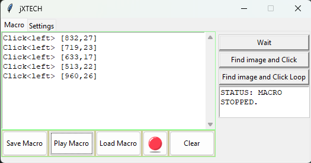
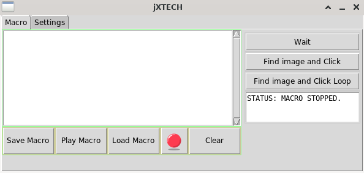

# jx-macro - Work in Progress

A program that record macro and play macros, no keyboard supported yet.
## On Windows

## On Linux (Xfce)

## Features
* Macros with mouse left and right click
* Move to click
* Find image on screen and click
* Keeps on Loop clicking on screen until the image is gone.
* Macros are saved as **JSON** files
* Multiplatform, tested on Linux and windows.

### All thanks to https://pyautogui.readthedocs.io/en/latest/ and https://pynput.readthedocs.io/en/latest/

## Dependencies

* Python 3.11

**OS Libraries (linux)**
* Tk
* Tix
* scrot
    
## Required System Libs on Arch
### find the equivalent lib on your Linux distribution

        $ sudo pacman -S tk
        $ yay -S tix
        $ sudo pacman -S scrot

